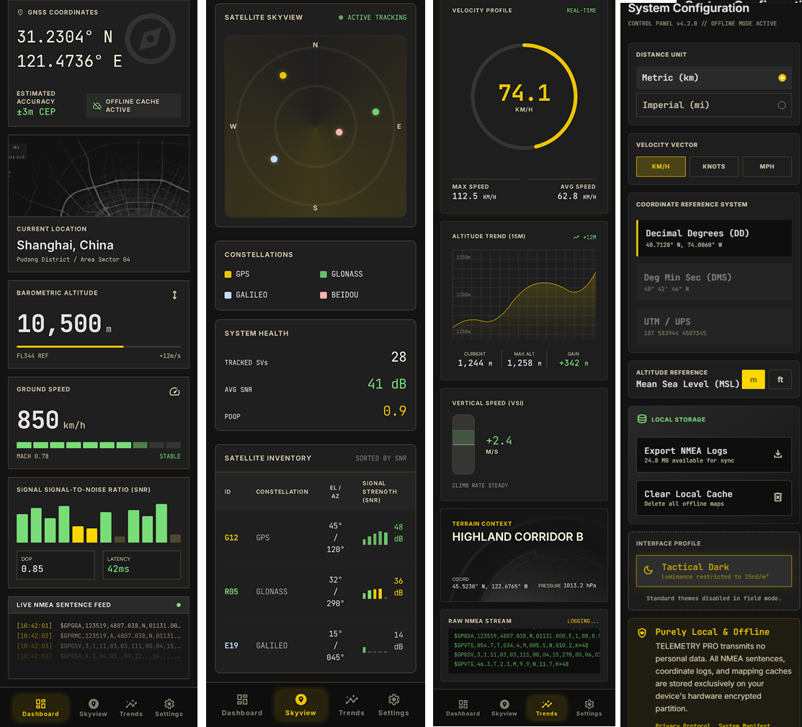

<div align="center">


# 🛰️ Telemetry Pro

**离线 GPS 遥测监控 · Aviation Glass-Cockpit Instrument Cluster**

[](https://kotlinlang.org)
[](https://developer.android.com/compose)
[](https://developer.android.com)
[](LICENSE)

[中文](#中文) · [English](#english)

</div>

<p align="center">
  
</p>

---

<a name="中文"></a>

## 中文

纯本地、零网络的 Android GPS 遥测监控应用。将手机化身为航空玻璃座舱仪表盘 — 实时 GNSS 数据、多星座卫星追踪、飞行模式检测，全部以航空级深色主题呈现。

### 功能

#### Dashboard 仪表盘
- **GNSS 坐标** — 经纬度 DD/DMS 双格式，每秒刷新
- **离线地图** — osmdroid 瓦片缓存，仅显示位置光点，无城市标签，无需网络
- **星座概览** — 每个星座的可见卫星数、参与定位数、最佳 SNR
- **气压高度**和**地面速度**（km/h）
- **SNR 柱状图** — 按星座着色，按信号强度排序
- **NMEA 日志流** — 实时滚动 GPS 原始语句

#### Skyview 卫星天图
- **雷达扫描器** — 动画扫描，星座着色卫星光点按仰角/方位角绘制
- **星座图例** — 可切换各系统显示/隐藏
- **卫星清单表** — SVID、星座、仰角、方位角、SNR (dB-Hz)、锁定状态（颜色标记）
- **健康摘要** — 总可见数、参与定位数、全系统最佳 SNR

#### Trends 趋势
- **速度表** — 环形进度指示器，实时 km/h 读数
- **高度趋势** — 近期高度历史折线图
- **垂直速度指示器 (VSI)** — 爬升/下降速率 m/s
- **地形背景** — 图表后方微妙的海拔渐变

#### Settings 设置
- **单位切换** — 公制 (km/h, m) / 英制 (mph, ft)
- **坐标格式** — DD（十进制度）、DMS（度分秒）、UTM
- **高度基准** — WGS84 椭球面或 MSL 校正
- **离线数据** — 导出 NMEA 日志、清除缓存地图瓦片
- **隐私声明** — 所有数据留在设备上，零网络传输

#### 飞行模式检测
自动识别高速/高空环境：
- **速度 > 200 km/h** → `FLIGHT?` 指示器
- **高度 > 8,000 m** → `HIGH ALT` 指示器

### 八星座区分

每个 GNSS 系统在所有视图中均独立识别并以专属颜色标记：

| 星座 | 颜色 | 色值 |
|:---|:---|:---|
| **GPS**（美国） | 信号绿 | `#78DC77` |
| **GLONASS**（俄罗斯） | 天蓝 | `#4FC3F7` |
| **Galileo**（欧盟） | 薰衣草紫 | `#CE93D8` |
| **BeiDou / 北斗**（中国） | 琥珀橙 | `#FFB74D` |
| **QZSS**（日本） | 青绿 | `#4DB6AC` |
| **IRNSS**（印度） | 玫瑰粉 | `#F48FB1` |
| **SBAS** | 中性灰 | `#9E9E9E` |
| **未知** | 暗灰 | `#616161` |

通过 Android `GnssStatus.getConstellationType()`（API 26+）识别。

### 点阵世界地图

仪表盘内置一个完全由 Jetpack Compose `Canvas` 渲染的交互式世界地图 — 无需网络、无需瓦片服务器、无需 Google Maps。采用点阵网格 + 城市标签 + GPS 定位标记，并支持完整的双指缩放/单指拖动。

**渲染管线**：多边形轮廓 → 126×60 二值网格 → 行程编码位图 → Canvas 渲染

```
┌──────────────────────────────────────────────────────────────────────┐
│  1. WorldMapData.kt         2. WorldMapGrid.kt      3. Canvas        │
│  ┌──────────────────┐      ┌──────────────────┐    ┌──────────────┐ │
│  │ 简化大陆          │  →   │ 126×60 位图      │ → │ drawPoints() │ │
│  │ 多边形轮廓        │      │ (RLE 压缩)       │    │ 逐可见网格   │ │
│  │ (7 大洲,          │      │ isLand(x,y):bool │    │ 单元绘制     │ │
│  │  ~500 顶点)       │      │ 离线预生成       │    │              │ │
│  └──────────────────┘      └──────────────────┘    └──────────────┘ │
└──────────────────────────────────────────────────────────────────────┘
```

#### 坐标系统

| 属性 | 值 |
|:---|:---|
| 网格尺寸 | 126 列 × 60 行 |
| 投影方式 | 等距矩形 (Plate Carrée) |
| X 轴 | -180° (第 0 列) → +180° (第 125 列)，线性映射 |
| Y 轴 | 墨卡托变换：`y = 60 × (1 - ln(tan(π/4 + φ/2)) / mercMax) / 2` |
| 网格单元 | 正方形：通过固定宽高比保证 `cellW == cellH` |
| Canvas 适配 | 126:60 letterbox — 短边填充留白，永不拉伸 |

Y 轴采用墨卡托投影来纠正等距矩形投影在极地附近的畸变。纬度被钳制在 ±85° 以避免极点的奇异性，然后通过逆 Gudermannian 函数映射：`yMerc = ln(tan(π/4 + φ/2))`。结果归一化到 0–60 的网格范围，呈现出视觉上熟悉的世界地图 — 格陵兰和南极洲的比例大小符合直觉。

#### 固定宽高比与 Letterbox

无论可用 Canvas 空间如何变化，地图始终保持 126:60 (2.1:1) 的固定宽高比：

```
若 canvasAspect > worldAspect (宽屏)：
  → 按高度适配，水平 letterbox
  → mapH = canvasH × scale, mapW = mapH × 2.1

若 canvasAspect < worldAspect (竖屏)：
  → 按宽度适配，垂直 letterbox
  → mapW = canvasW × scale, mapH = mapW / 2.1

网格单元尺寸：
  cellW = mapW / 126, cellH = mapH / 60
  由于 mapW/mapH = 126/60 → cellW == cellH (正方形单元)
```

Letterbox 区域作为天然的视口边界 — 地图内容完美居中，多余空间以背景色填充。这是解决早期版本"地图变形"问题的根本方案。

#### GPS 定位标记

当获取到 GNSS 定位时，用户位置以醒目的发光十字准星绘制在地图上：

- **外层脉冲环** — 12px 半径，Primary 色 35% 透明度
- **中层实心环** — 5px 实心 Primary
- **核心圆点** — 2.5px PrimaryFixed（不透明）
- **十字准星** — 四个方向各 10px，60% 透明
- **坐标标签** — `lat, lon` 等宽字体，自适应大小 (7–12sp)

位置从 WGS84 坐标通过墨卡托网格变换映射为 Canvas 像素坐标，与所有地图元素共用同一套投影算法。

#### 手势交互

```
┌────────────────────────────────────────────────────┐
│ detectTransformGestures()                           │
│                                                     │
│  输入: centroid(px), pan(dx,dy), zoom(factor)       │
│                                                     │
│  ┌─────────────┐    ┌──────────────────────┐        │
│  │ 单指拖动     │ →  │ offset += pan (平移)  │        │
│  │ pan          │    │ 纯偏移累加            │        │
│  └─────────────┘    └──────────────────────┘        │
│                                                     │
│  ┌─────────────┐    ┌──────────────────────┐        │
│  │ 双指捏合     │ →  │ 锚定缩放:             │        │
│  │ pinch        │    │                       │        │
│  │              │    │ actualZoom = newScale  │        │
│  │              │    │             / oldScale │        │
│  │              │    │                       │        │
│  │              │    │ offset = centroid      │        │
│  │              │    │   - newLeft            │        │
│  │              │    │   - actualZoom         │        │
│  │              │    │   × (centroid          │        │
│  │              │    │      - oldLeft         │        │
│  │              │    │      - offset)         │        │
│  └─────────────┘    └──────────────────────┘        │
│                                                     │
│  缩放范围: 0.5× – 5.0×                               │
└────────────────────────────────────────────────────┘
```

**锚定缩放**是关键细节：当 scale 改变时，`mapLeft`/`mapTop` 也会因 letterbox 区域变化而改变。公式补偿了这一偏移，使得双指中点在地图内容上保持静止。没有这个补偿，地图会在缩放时向屏幕左上角漂移 — 这个 bug 在 v1.6.0–v1.6.3 持续存在，最终在 v1.6.4 彻底修复。

#### 自动居中

首次绘制时，地图自动以 GPS 定位点为中心：

- **已有定位** → 居中于实际 `(纬度, 经度)`
- **尚未定位** → 回退居中于中国中心 (35°N, 105°E)
- `centeredOnFix` 标志确保每次定位获取仅执行一次居中 — 后续拖动完全由用户控制

#### 城市标签（210 个城市）

城市标记以两个视觉层级呈现，均随缩放比例变化：

| 缩放 | 可见性 |
|:---|:---|
| < 0.8× | 隐藏（避免杂乱） |
| 0.8× – 1.0× | 仅显示半透明空心圆 (30% 透明) |
| 1.0× – 2.0× | 空心圆 (50% 透明) |
| ≥ 2.0× | 空心圆 + 城市名称标签 (70% 透明)，自适应字号 |

标签字号与缩放反向缩放：`(9 / scale).coerceIn(6sp, 11sp)` — 缩小时标签缩小防止重叠，放大时标签增大便于阅读。标签垂直偏移于标记圆下方 4px，水平居中。

各区域覆盖：

| 区域 | 数量 | 示例 |
|:---|:---|:---|
| 中国 | 35 | 北京、上海、重庆、武汉、成都、哈尔滨… |
| 东亚 | 6 | 东京、首尔、乌兰巴托… |
| 东南亚 | 11 | 曼谷、新加坡、雅加达、马尼拉、河内… |
| 南亚 | 9 | 德里、孟买、达卡、科伦坡、加德满都… |
| 中亚 | 5 | 塔什干、阿斯塔纳、比什凯克… |
| 俄罗斯 | 8 | 海参崴、新西伯利亚、伊尔库茨克、喀山… |
| 西亚/中东 | 15 | 迪拜、利雅得、德黑兰、巴格达、伊斯坦布尔… |
| 欧洲 | 40 | 伦敦、巴黎、柏林、莫斯科、罗马、马德里… |
| 非洲 | 29 | 开罗、拉各斯、内罗毕、开普敦、金夏沙、杜阿拉… |
| 北美洲 | 23 | 纽约、洛杉矶、西雅图、丹佛、多伦多、墨西哥城… |
| 南美洲 | 16 | 圣保罗、布宜诺斯艾利斯、利马、基多、拉巴斯… |
| 大洋洲 | 13 | 悉尼、墨尔本、奥克兰、达尔文、火奴鲁鲁… |

城市标签通过 Compose `TextMeasurer` 用 `drawText()` 渲染 — 每个标签无 `BasicText` 组合项开销。可见性由缩放阈值和 Canvas 边界双重控制（超出 ±50px 边距即剔除）。

#### 轨迹记录路径

当用户录制轨迹时（设置 → 轨迹录制），航点绘制为：

- **路径线段** — Secondary（信号绿）50% 透明，1.5px 描边
- **起点标记** — 4px 实心圆，80% 透明
- **终点标记** — 4px 实心圆，PrimaryFixed（不透明安全黄）

#### 全屏地图

点击仪表盘上的 ⛶ 按钮打开 `FullscreenMapScreen`：

- 强制**传感器横屏**方向 (`SCREEN_ORIENTATION_SENSOR_LANDSCAPE`)
- 隐藏所有 UI 装饰：标题栏、缩放提示、圆角边框
- `DotMatrixMap(isFullscreen = true)` 渲染纯 Canvas 全屏地图
- 通过返回手势或系统返回键退出，恢复竖屏

全屏模式复用相同的 `DotMatrixMap` 组件 — 仅修饰符和装饰不同，确保视觉一致性。

#### 数据文件

| 文件 | 大小 | 作用 |
|:---|:---|:---|
| `WorldMapData.kt` | ~580 行 | 7 大洲多边形轮廓 + 210 个城市坐标 |
| `WorldMapGrid.kt` | ~120 行 | 126×60 RLE 位图：`isLand(col, row)` 高速网格查询 |
| `DotMatrixMap.kt` | ~335 行 | Canvas 组件：投影、渲染、手势处理 |

### 架构

```
┌────────────────────────────────────────────────┐
│                  Jetpack Compose UI              │
│  ┌───────┐ ┌───────┐ ┌───────┐ ┌───────┐      │
│  │仪表盘  │ │卫星天图│ │趋势图  │ │ 设置  │      │
│  └───┬───┘ └───┬───┘ └───┬───┘ └───┬───┘      │
│      └──────────┴──────────┴─────────┘          │
│                       │                          │
│              GpsViewModel（共享）                 │
│              LocationState StateFlow              │
├───────────────────────┼──────────────────────────┤
│               GpsRepository                      │
│  ┌────────────────┼──────────────────────┐       │
│  │        LocationManager (Android)      │       │
│  │  ┌────────┐ ┌────────┐ ┌─────────┐   │       │
│  │  │位置监听│ │GNSS回调│ │NMEA监听 │   │       │
│  │  │(1秒)  │ │(原始数据)│ │(原始语句)│  │       │
│  │  └────────┘ └────────┘ └─────────┘   │       │
│  └──────────────────────────────────────┘       │
├──────────────────────────────────────────────────┤
│                  Android GNSS 硬件层               │
└──────────────────────────────────────────────────┘
```

**MVVM + StateFlow** — 四个页面共享一个 `GpsViewModel`，统一的 `LocationState` 数据类供所有视图消费。`WhileSubscribed(5000)` 策略确保最后一个观察者离开后 GPS 仍运行 5 秒。

**零 Google Play Services** — 仅使用 `android.location.LocationManager`，可在 AOSP/非 Google 设备运行，完全无需网络。

**1 秒刷新周期** — 三路并行事件驱动数据流：`LocationListener`、`GnssStatus.Callback`、`NMEAListener`。

### 项目结构

```
TelemetryPro/
├── app/
│   └── src/main/
│       ├── AndroidManifest.xml
│       ├── java/com/telemetrypro/app/
│       │   ├── MainActivity.kt          # 入口，导航宿主
│       │   ├── data/
│       │   │   ├── Constellation.kt     # 八星座枚举 + 颜色映射
│       │   │   ├── GpsRepository.kt     # LocationManager 封装
│       │   │   ├── LocationState.kt     # UI 状态数据类
│       │   │   └── SatelliteInfo.kt     # 卫星 + 统计模型
│       │   ├── viewmodel/
│       │   │   └── GpsViewModel.kt      # 共享 ViewModel
│       │   └── ui/
│       │       ├── theme/               # Astra Precision 设计令牌
│       │       ├── components/          # 可复用组件
│       │       ├── map/                 # 点阵世界地图
│       │       │   ├── DotMatrixMap.kt   # Canvas + 手势 + 投影
│       │       │   ├── WorldMapData.kt   # 7 大洲 + 210 城市
│       │       │   └── WorldMapGrid.kt   # 126×60 RLE 陆地位图
│       │       └── screens/             # 5 个页面
│       └── res/
├── build.gradle.kts
├── settings.gradle.kts
└── README.md
```

### 设计系统 — Astra Precision

| 角色 | 色值 | 用途 |
|:---|:---|:---|
| 背景 | `#131313` | 深炭黑底色 |
| 表面 | `#201F1F` | 卡片面板 |
| 主色（安全黄） | `#FFD700` | 定位状态、关键数据 |
| 副色（信号绿） | `#78DC77` | 健康状态、已锁定卫星 |
| 第三色（大气蓝） | `#2196F3` | 辅助数据 |
| 前景文字 | `#E5E2E1` | 主要文字 |

**字体**：JetBrains Mono（数据数值 — 等宽防抖）+ Inter（标签、导航）

**特效**：12px 柔光（模拟 LED/CRT 荧光）、呼吸动画状态灯、色调深浅层次

### 构建

```bash
git clone https://github.com/th2006464/TelemetryPro.git
cd TelemetryPro
./gradlew assembleDebug
```

| 组件 | 版本 |
|:---|:---|
| Kotlin | 1.9.21 |
| Compose BOM | 2023.10.01 |
| 最低 SDK | 26 (Android 8.0) |
| 目标 SDK | 34 |
| Gradle | 8.2 |
| osmdroid | 6.1.18 |

### 开发心得

1. **主题即代码** — Astra Precision 设计令牌 1:1 移植到 `Color.kt`/`Type.kt`/`Shape.kt`，后续新增页面自动继承航空美学。
2. **字体本地化** — JetBrains Mono + Inter 打包为 Android `font` 资源，首次启动即可离线使用（区别于 HTML 原型依赖 Google Fonts CDN）。
3. **osmdroid 替代 Google Maps** — 无 Play Services 依赖，可配置磁盘缓存，关闭地名标签，仅显示位置光点。
4. **GnssStatus.Callback 替代 GpsStatus.Listener** — 现代 API（24+）提供 `getConstellationType()` 实现八星座区分，并支持逐卫星 `hasAlmanacData()`/`hasEphemerisData()`。
5. **单一 ViewModel** — 四个页面共用同一个 GPS 数据源，生命周期由 `MainActivity` 统一管理，切换标签不重启 GNSS 引擎。
6. **速度噪声** — `Location.getSpeed()` 返回 m/s，低速时有抖动。当前展示原始读数，后续优化方向：指数移动平均滤波。
7. **纯 JDK 构建** — 无需 Android Studio。关键配置：`local.properties` 指向 SDK 根目录、`ANDROID_HOME` 环境变量、`gradle.properties` 设置 `android.useAndroidX=true`。
8. **点阵地图手势演进** — 地图手势经历了四轮迭代：v1.4.2 将地图从 ScrollView 中移出（解决事件被父组件拦截）；v1.6.1 尝试手动 `awaitPointerEventScope` 底层事件处理（因 `awaitEachGesture` 无 Compose 1.5.x 支持而放弃）；v1.6.2 实现 anchored zoom 但缺 `mapLeft` 补偿（放大时向左上角漂移）；v1.6.4 回归 `detectTransformGestures` 并补全 letterbox 偏移补偿，最终根治所有交互问题。
9. **负数取模陷阱** — Kotlin 的 `%` 运算符对负数返回负值（与 Python/数学定义不同），导致 v1.6.3 地图网格整整偏移 48 列。移除取模操作、直接使用原始偏移值是最简解决方案。

### 维护指南（给后续 AI / 开发者）

> 本章节是项目的「护身符」。TelemetryPro 经过 v1.4–v1.7 共 13 个版本的迭代，踩过许多 Compose / Android GNSS / 坐标投影的坑。下列内容记录了**哪些代码不能随意改动**、**常见问题的根因**、以及**维护时必须遵守的规则**。任何 AI 或人类在修改本项目前，请先通读本节。

#### 一、架构总览与分层职责

```
┌─────────────────────────────────────────────────────────────┐
│  UI 层 (ui/screens, ui/components, ui/map)                    │
│  - 纯 Compose，无 Android Framework 调用（除 Activity 引用）  │
│  - 通过 StateFlow 收集状态，事件回调上抛 ViewModel            │
│  - 严禁在 Composable 中直接调用 LocationManager              │
├─────────────────────────────────────────────────────────────┤
│  ViewModel 层 (viewmodel/GpsViewModel.kt)                    │
│  - 唯一的状态聚合点：combine(gpsState, recording, ...)        │
│  - SharingStarted.WhileSubscribed(5000) — 离开页面 5s 后停 GPS │
│  - 持有 SharedPreferences（在线模式开关持久化）                │
│  - 网络监控：registerDefaultNetworkCallback + checkNetworkImmediate │
├─────────────────────────────────────────────────────────────┤
│  Repository 层 (data/GpsRepository.kt)                       │
│  - 封装 LocationManager，三路监听并行：                       │
│    LocationListener(1s) + GnssStatus.Callback + NMEAListener │
│  - 卫星去重：按 (constellationType, svid) 去重，后覆盖前      │
│  - NaN 清洗：getCn0DbHz() 可能返回 NaN，必须过滤              │
│  - 无 Google Play Services 依赖（纯 AOSP API）                │
├─────────────────────────────────────────────────────────────┤
│  数据层 (data/*.kt)                                          │
│  - LocationState: 单一 UI 状态数据类，所有页面共用            │
│  - Constellation: 8 星座枚举，映射 Android GnssStatus 常量    │
│  - SatelliteInfo: 单卫星模型，lockStatus 为派生属性           │
│  - TrackRepository/TrackSession: 轨迹录制（Room 预留）        │
└─────────────────────────────────────────────────────────────┘
```

**关键设计原则**：
- **单一 ViewModel**：四个页面共用 `GpsViewModel`，生命周期绑定 `MainActivity`。切换 Tab 不重启 GNSS。
- **单一状态流**：`LocationState` 是唯一 UI 状态来源。新增字段直接加到 data class，UI 通过 `state.xxx` 读取。
- **零网络依赖**：除在线模式（AGPS 辅助）外，所有功能离线可用。地图完全自渲染，无瓦片下载。

#### 二、红线代码清单（严禁随意修改）

以下代码经过多轮调试才稳定工作，**修改前必须充分理解其历史背景**：

| 文件 / 位置 | 代码 | 为什么不能动 |
|:---|:---|:---|
| `DotMatrixMap.kt` 锚定缩放公式 | `offsetX = centroid.x - newLeft - actualZoom * (centroid.x - oldLeft - offsetX)` | 缺少 `newLeft`/`oldLeft` 补偿会导致缩放时地图向左上角漂移（v1.6.2 bug）。`mapLeft` 随 scale 变化，必须用 old/new 两套值计算。 |
| `DotMatrixMap.kt` `gridStartX` | `val gridStartX = mapLeft + offsetX`（**无取模**） | v1.6.3 曾用 `% cellW` 导致负数取模 bug，地图偏移 48 列。Kotlin `%` 对负数返回负值，与 Python 不同。**永远不要加回取模**。 |
| `DotMatrixMap.kt` `latLngToCanvas` | `gridStartX + gx * cellW`（**无 +cellW/2**） | v1.7.1 移除了多余的半格偏移。`gx` 已是连续坐标，加半格会导致城市标签与陆地点阵错位，全屏模式尤其明显。 |
| `DotMatrixMap.kt` `centeredOnFix` 标志 | 首次 fix 时居中一次，之后用户控制 | 若每次 fix 都重置 offset，用户拖动后会被瞬间拉回。`centeredOnFix` 确保"居中仅一次"语义。 |
| `DotMatrixMap.kt` 固定宽高比 | `worldAspect = 126f / 60f` + letterbox | 横屏全屏时若按 Canvas 实际宽高拉伸，地图会变形。固定 2.1:1 + letterbox 是唯一正确方案。 |
| `GpsRepository.kt` 卫星去重 | `satMap[constellationType to svid] = info` | 部分设备同一卫星会以 UNKNOWN + 真实星座双重上报，不去重会导致 LazyColumn key 冲突崩溃（v1.6.4 闪退根因）。 |
| `SkyviewScreen.kt` LazyColumn key | `key = { "${it.constellation.constellationType}_${it.svid}" }` | 必须用 `constellationType`（Int）而非 `label`（String），因为 UNKNOWN 星座下 svid 跨系统重叠。**不能用 label + svid**。 |
| `GpsViewModel.kt` 网络监控 | `registerDefaultNetworkCallback` + `checkNetworkImmediate()` | v1.6.2 曾用 `registerNetworkCallback(NetworkRequest)`，部分设备回调不触发。`registerDefaultNetworkCallback` 更可靠，配合主动查询避免竞态。 |
| `GpsRepository.kt` NaN 清洗 | `status.getCn0DbHz(i).let { if (it.isNaN() \|\| it < 0) 0f else it }` | `getCn0DbHz` 在卫星无信号时返回 NaN，`coerceIn` 对 NaN 无效，会导致 SNR 柱状图和 avgSnr 计算异常。 |
| `WorldMapGrid.kt` RLE 位图 | `bitmap: ByteArray` + `isLand(x, y)` | 这是离线预生成的 126×60 陆地位图，**不要手动编辑字节**。如需更新海岸线，用脚本重新生成。 |
| `FullscreenMapScreen.kt` 横屏 | `requestedOrientation = SCREEN_ORIENTATION_SENSOR_LANDSCAPE` | 全屏地图必须横屏，否则点阵布局错乱。`DisposableEffect` 退出时恢复 `UNSPECIFIED`。 |

#### 三、常见问题与排查思路

**1. 地图无法拖动 / 缩放漂移**
- 检查 `DotMatrixMap` 是否被嵌套在 `ScrollView`/`Column` 内且未加 `.clipToBounds()` — 父组件会拦截触摸事件
- 检查 `detectTransformGestures` 是否被替换为手动 `awaitPointerEventScope` — Compose 1.5.x 中后者极易出错，**坚持用原生 API**
- 检查 anchored zoom 公式是否包含 `oldLeft`/`newLeft` — 缺失会导致缩放向左上角漂移

**2. 进入 Skyview 页面闪退**
- 根因 99% 是 LazyColumn key 不唯一。检查 `GpsRepository.updateSatelliteData()` 是否做了 `(constellationType, svid)` 去重
- 检查 `SkyviewScreen` 的 `items(key = ...)` 是否用了 `constellationType`（Int）而非 `label`（String）
- 检查 SNR 是否有 NaN — `coerceIn` 对 NaN 无效，需先 `isNaN()` 判断

**3. 在线模式切换后显示"等待网络"**
- `registerDefaultNetworkCallback` 必须配合 `checkNetworkImmediate()` 主动查询
- `setOnlineMode()` 中必须调用 `repository.restart()` 重启 GPS 监听
- 切换时立即调用 `checkNetworkImmediate()` 刷新状态，不等回调

**4. 地图变形 / 城市标签错位**
- 检查 `gridStartX` 是否被加了 `% cellW` — 移除它
- 检查 `latLngToCanvas` 是否被加了 `+ cellW/2` — 移除它
- 检查 `mapW`/`mapH` 计算是否遵循固定 126:60 宽高比 — 不能用 Canvas 实际宽高直接拉伸

**5. 构建失败：找不到 Java / SDK**
- `JAVA_HOME` 必须指向 JDK 17（项目路径：`C:/Users/Fox/.workbuddy/android-tools/jdk-17.0.19+10`）
- `local.properties` 中 `sdk.dir` 必须指向 Android SDK 根目录
- Gradle 8.2 + Kotlin 1.9.21 + Compose BOM 2023.10.01 是验证过的组合，**不要随意升级**

**6. GitHub Release 中文乱码**
- PowerShell heredoc 中的 curl `--data-binary` 会破坏 UTF-8 编码
- 解决：将 JSON 写入独立 `.json` 文件，用 `curl -d @file.json` 读取

#### 四、维护流程规则

1. **改前先读**：修改任何文件前，先读全文理解上下文，不要凭函数名猜测
2. **小步提交**：每次只改一个功能点，立即构建验证，再继续下一个
3. **保留注释**：代码中的 `// 关键` / `// 不要修改` 注释是历史教训，保留它们
4. **版本号递增**：每次发布 `versionCode + 1`，`versionName` 按语义化版本
5. **APK 命名**：`TelemetryPro_v{versionName}.apk`，通过 `build.gradle.kts` 的 `outputFileName` 配置
6. **构建命令**：
   ```bash
   export JAVA_HOME="C:/Users/Fox/.workbuddy/android-tools/jdk-17.0.19+10"
   cd D:/workbuddy/gps/TelemetryPro
   ./gradlew assembleDebug
   ```
7. **发布流程**：commit → push main → 创建 tag → GitHub API 创建 Release → 上传 APK
8. **测试要点**：室内（无 fix）+ 室外（有 fix）+ 全屏地图 + Skyview 有卫星时进入

#### 五、给 AI 维护者的特别指引

> 如果你是接手本项目的 AI 助手，请特别注意：

1. **不要"优化"地图手势代码**。`detectTransformGestures` + anchored zoom 公式是四轮迭代后的最终方案。任何"简化"都会引入 bug。
2. **不要给 `latLngToCanvas` 加半格偏移**。`gx` 是连续浮点坐标，不需要 `+ cellW/2`。加了会导致城市标签与陆地点阵错位。
3. **不要给 `gridStartX` 加取模**。Kotlin `%` 对负数返回负值，会破坏网格定位。
4. **不要把 LazyColumn key 改成 `label + svid`**。UNKNOWN 星座下 svid 跨系统重叠，必须用 `constellationType`（Int）。
5. **不要用 `registerNetworkCallback(NetworkRequest)`**。部分设备回调不触发，必须用 `registerDefaultNetworkCallback`。
6. **不要移除 NaN 检查**。`getCn0DbHz()` 和 `coerceIn()` 对 NaN 的行为不符合直觉。
7. **不要把地图放进 ScrollView**。父组件会拦截单指拖动事件。
8. **不要升级 Gradle / Kotlin / Compose 版本**除非充分测试。当前组合是验证过的稳定版本。
9. **修改前先读 `D:/workbuddy/gps/.workbuddy/memory/` 下的日志**，了解历史决策和踩坑记录。
10. **构建后必须实际安装测试**，不要假设编译通过就等于功能正确。地图手势、Skyview 闪退、网络状态这些问题只在运行时暴露。

#### 六、数据流详解

```
Android GNSS HAL
      │
      ▼
LocationManager
      │
      ├── LocationListener (1s 间隔)
      │     └── onLocationChanged → updateLocationData()
      │           └── 更新 latitude/longitude/speed/altitude → _locationState
      │
      ├── GnssStatus.Callback
      │     └── onSatelliteStatusChanged → updateSatelliteData()
      │           └── 去重 + NaN 清洗 + 分组统计 → _locationState.satellites
      │
      └── NMEAListener
            └── onNmeaMessage → _nmeaBuffer (仅当 nmeaLoggingEnabled)
                  └── 滚动缓冲区 (max 30 行) → _locationState.nmeaLogLines

GpsViewModel
      │
      ├── combine(locationState, isRecording, distanceKm, trackPoints)
      │     └── → state: StateFlow<LocationState>  (UI 唯一数据源)
      │
      ├── observeGpsForTracking()
      │     └── locationState.collect → trackRepository.appendPoint() (录制中)
      │
      └── monitorNetwork()
            └── registerDefaultNetworkCallback + checkNetworkImmediate
                  └── → isNetworkAvailable: StateFlow<Boolean>

UI Screens
      └── collectAsState() → Compose 重组 → Canvas 渲染
```

**状态更新频率**：LocationListener 每 1 秒触发，GnssStatus 每次卫星状态变化触发（通常 1–4 秒）。UI 重组由 StateFlow 驱动，无需手动 invalidate。

### 权限

```xml
ACCESS_FINE_LOCATION   -- GPS 精确定位
ACCESS_COARSE_LOCATION -- 网络定位（备用）
FOREGROUND_SERVICE_LOCATION -- 后台持续定位（预留）
INTERNET               -- osmdroid 首次瓦片下载（离线后缓存）
```

### 许可证

MIT — 详见 [LICENSE](LICENSE)。

---

<a name="english"></a>

## English

Pure-local, network-free Android app that turns your device into a glass-cockpit instrument cluster. Real-time GNSS data, multi-constellation satellite tracking, and flight mode detection — all rendered in an aviation-grade dark theme.

### Features

#### Dashboard
- **GNSS coordinates** — latitude/longitude in DD and DMS formats, refreshed every second
- **Offline map** — osmdroid tile cache shows current position as a glowing dot; no city labels, no network needed
- **Constellation summary** — per-constellation satellite count, used-in-fix count, best SNR
- **Barometric altitude** and **ground speed** in km/h
- **SNR bar graph** — colour-coded by constellation, sorted by signal strength
- **NMEA log stream** — live scrolling raw sentences from the GPS receiver

#### Skyview
- **Radar scanner** — animated sweep with constellation-coloured satellite dots plotted by elevation/azimuth
- **Constellation legend** — toggle individual systems on/off
- **Satellite table** — SVID, constellation, EL/AZ, SNR (dB-Hz), lock status with colour coding
- **Health summary** — total visible, used in fix, best SNR across all systems

#### Trends
- **Speed gauge** — circular arc progress indicator with real-time km/h readout
- **Altitude trend** — line chart of recent elevation history
- **Vertical speed indicator (VSI)** — climb/descent rate in m/s
- **Terrain background** — subtle elevation gradient behind charts

#### Settings
- **Units** — toggle between metric (km/h, m) and imperial (mph, ft)
- **Coordinate format** — DD (decimal degrees), DMS (degrees-minutes-seconds), UTM
- **Altitude reference** — WGS84 ellipsoid or MSL correction
- **Offline data** — export NMEA logs, clear cached map tiles
- **Privacy** — all data stays on device, zero network transmission

#### Flight Mode Detection
Automatically detects high-speed/high-altitude environments:
- **Speed > 200 km/h** → `FLIGHT?` indicator
- **Altitude > 8,000 m** → `HIGH ALT` indicator

### 8-Constellation Differentiation

Each GNSS system is identified and colour-coded in every view:

| Constellation | Colour | Hex |
|:---|:---|:---|
| **GPS** (USA) | Signal Green | `#78DC77` |
| **GLONASS** (Russia) | Sky Blue | `#4FC3F7` |
| **Galileo** (EU) | Lavender Purple | `#CE93D8` |
| **BeiDou** (China) | Amber Orange | `#FFB74D` |
| **QZSS** (Japan) | Teal | `#4DB6AC` |
| **IRNSS** (India) | Rose Pink | `#F48FB1` |
| **SBAS** | Neutral Grey | `#9E9E9E` |
| **Unknown** | Dark Grey | `#616161` |

Identified via Android `GnssStatus.getConstellationType()` (API 26+).

### Dot-Matrix World Map

The dashboard features an embedded interactive world map rendered entirely in a Jetpack Compose `Canvas` — no network, no tile servers, no Google Maps. The map uses a dot-matrix grid with city labels, GPS position marker, and full pinch-zoom/pan gesture support.

**Pipeline**: Polygon outlines → 126×60 binary grid → run-length-encoded bitmap → Canvas rendering

```
┌──────────────────────────────────────────────────────────────────────┐
│  1. WorldMapData.kt         2. WorldMapGrid.kt      3. Canvas        │
│  ┌──────────────────┐      ┌──────────────────┐    ┌──────────────┐ │
│  │ Simplified        │  →   │ 126×60 bitmap    │ → │ drawPoints() │ │
│  │ continent polygons│      │ (RLE compressed) │    │ per visible  │ │
│  │ (7 continents,    │      │ isLand(x,y): bool│    │ grid cell    │ │
│  │  ~500 vertices)   │      │ generated offline│    │              │ │
│  └──────────────────┘      └──────────────────┘    └──────────────┘ │
└──────────────────────────────────────────────────────────────────────┘
```

#### Coordinate System

| Property | Value |
|:---|:---|
| Grid dimensions | 126 columns × 60 rows |
| Projection | Equirectangular (Plate Carrée) |
| X-axis | -180° (col 0) → +180° (col 125), linear |
| Y-axis | Mercator transform: `y = 60 × (1 - ln(tan(π/4 + φ/2)) / mercMax) / 2` |
| Cell shape | Square: `cellW == cellH` guaranteed by fixed aspect ratio |
| Canvas fit | 126:60 letterbox — pad shorter axis, never stretch |

The Y-axis uses a Mercator projection to correct polar distortion inherent in equirectangular maps. Latitudes are clamped to ±85° to prevent the singularities at the poles, then mapped through the inverse Gudermannian function: `yMerc = ln(tan(π/4 + φ/2))`. The result is normalized to the 0–60 grid range, producing a visually familiar world map where Greenland and Antarctica appear proportionally sized.

#### Fixed Aspect Ratio & Letterbox

The map enforces a strict 126:60 (2.1:1) aspect ratio regardless of the available canvas space:

```
If canvasAspect > worldAspect (wide screen):
  → Fit to canvas height, letterbox horizontally
  → mapH = canvasH × scale, mapW = mapH × 2.1

If canvasAspect < worldAspect (tall screen):
  → Fit to canvas width, letterbox vertically
  → mapW = canvasW × scale, mapH = mapW / 2.1

Grid cell size:
  cellW = mapW / 126, cellH = mapH / 60
  Since mapW/mapH = 126/60 → cellW == cellH (square cells)
```

The letterbox region acts as a natural viewport — the map content is perfectly centered, with extra space rendered as the background color. This is the root fix for the "map distortion" issue that plagued earlier versions.

#### GPS Position Marker

When a GNSS fix is acquired, the user's position is drawn on the map with a distinctive glowing crosshair:

- **Outer pulse ring** — 12px radius, Primary colour at 35% alpha
- **Mid ring** — 5px solid Primary
- **Core dot** — 2.5px PrimaryFixed (opaque)
- **Crosshair** — 20px lines in cardinal directions, 60% alpha
- **Coordinate label** — `lat, lon` in monospace font, scale-adaptive size (7–12sp)

Position is mapped from WGS84 coordinates to canvas pixel coordinates through the same Mercator grid transform used for all map elements.

#### Gesture Interaction

```
┌────────────────────────────────────────────────────┐
│ detectTransformGestures()                           │
│                                                     │
│  Input: centroid(px), pan(dx,dy), zoom(factor)      │
│                                                     │
│  ┌─────────────┐    ┌──────────────────────┐        │
│  │ Single finger│ →  │ offset += pan (drag)  │        │
│  │ pan          │    │ clamp pan only        │        │
│  └─────────────┘    └──────────────────────┘        │
│                                                     │
│  ┌─────────────┐    ┌──────────────────────┐        │
│  │ Two-finger   │ →  │ Anchored zoom:        │        │
│  │ pinch        │    │                       │        │
│  │              │    │ actualZoom = newScale  │        │
│  │              │    │             / oldScale │        │
│  │              │    │                       │        │
│  │              │    │ offset = centroid      │        │
│  │              │    │   - newLeft            │        │
│  │              │    │   - actualZoom         │        │
│  │              │    │   × (centroid          │        │
│  │              │    │      - oldLeft         │        │
│  │              │    │      - offset)         │        │
│  └─────────────┘    └──────────────────────┘        │
│                                                     │
│  Scale range: 0.5× – 5.0×                           │
└────────────────────────────────────────────────────┘
```

**Anchored zoom** is the critical detail: when the scale changes, `mapLeft`/`mapTop` also change because the letterbox region shifts. The formula compensates for this shift, keeping the pinch centroid stationary relative to the map content. Without this compensation, the map would "drift" toward the top-left corner during zoom — a bug that persisted across v1.6.0–v1.6.3 and was finally resolved in v1.6.4.

#### Auto-Centering

On first draw, the map centers on the user's GPS position:
- **Has fix** → center on actual `(latitude, longitude)`
- **No fix** → fallback to China center (35°N, 105°E)
- The `centeredOnFix` flag ensures centering executes exactly once per fix acquisition — subsequent pans are user-controlled

#### City Labels (210 Cities)

City markers appear in two visual layers, both scale-dependent:

| Scale | Visibility |
|:---|:---|
| < 0.8× | Hidden (prevents clutter) |
| 0.8× – 1.0× | Faint hollow circles only (30% alpha) |
| 1.0× – 2.0× | Hollow circles (50% alpha) |
| ≥ 2.0× | Circles + city name labels at 70% alpha, adaptive font size |

Label font size scales inversely with zoom: `(9 / scale).coerceIn(6sp, 11sp)` — labels shrink when zoomed out to prevent overlap, and grow when zoomed in for readability. Labels are vertically offset by 4px below the marker circle, horizontally centered.

Coverage by region:

| Region | Count | Examples |
|:---|:---|:---|
| China | 35 | Beijing, Shanghai, Chongqing, Wuhan, Chengdu, Harbin… |
| East Asia | 6 | Tokyo, Seoul, Ulaanbaatar… |
| Southeast Asia | 11 | Bangkok, Singapore, Jakarta, Manila, Hanoi… |
| South Asia | 9 | Delhi, Mumbai, Dhaka, Colombo, Kathmandu… |
| Central Asia | 5 | Tashkent, Astana, Bishkek… |
| Russia | 8 | Vladivostok, Novosibirsk, Irkutsk, Kazan… |
| West Asia / Middle East | 15 | Dubai, Riyadh, Tehran, Baghdad, Istanbul… |
| Europe | 40 | London, Paris, Berlin, Moscow, Rome, Madrid… |
| Africa | 29 | Cairo, Lagos, Nairobi, Cape Town, Kinshasa, Douala… |
| North America | 23 | New York, Los Angeles, Seattle, Denver, Toronto, Mexico City… |
| South America | 16 | São Paulo, Buenos Aires, Lima, Quito, La Paz… |
| Oceania | 13 | Sydney, Melbourne, Auckland, Darwin, Honolulu… |

City labels are rendered with `drawText()` using the Compose `TextMeasurer` — no `BasicText` composable overhead per label. Visibility is gated by both scale threshold and canvas bounds (culled if outside ±50px margin).

#### Track Recording Path

When the user records a track (via Settings → Track Recording), waypoints are drawn as:
- **Path line** — Secondary (signal green) at 50% alpha, 1.5px stroke
- **Start marker** — 4px filled circle, 80% alpha
- **End marker** — 4px filled circle, PrimaryFixed (opaque safety yellow)

#### Full-Screen Map

Tapping the ⛶ button on the dashboard opens `FullscreenMapScreen`:
- Forces **sensor landscape** orientation (`SCREEN_ORIENTATION_SENSOR_LANDSCAPE`)
- Hides all UI chrome: title bar, pinch hint, rounded borders
- `DotMatrixMap(isFullscreen = true)` renders a bare full-canvas map
- Exits by back gesture or system back button, restoring portrait

The full-screen variant reuses the identical `DotMatrixMap` composable — only the modifier and chrome differ, ensuring visual consistency.

#### Data Files

| File | Size | Role |
|:---|:---|:---|
| `WorldMapData.kt` | ~580 lines | 7 continent polygon outlines + 210 city coordinates |
| `WorldMapGrid.kt` | ~120 lines | 126×60 RLE bitmap: `isLand(col, row)` for fast cell lookup |
| `DotMatrixMap.kt` | ~335 lines | Canvas composable: projection, rendering, gesture handling |

### Architecture

```
┌─────────────────────────────────────────────────────┐
│                   Jetpack Compose UI                  │
│  ┌──────────┐ ┌──────────┐ ┌──────────┐ ┌────────┐ │
│  │Dashboard │ │ Skyview  │ │  Trends  │ │Settings│ │
│  └────┬─────┘ └────┬─────┘ └────┬─────┘ └───┬────┘ │
│       └─────────────┴────────────┴───────────┘       │
│                         │                            │
│              GpsViewModel (shared)                    │
│              LocationState StateFlow                  │
├──────────────────────┼──────────────────────────────┤
│               GpsRepository                          │
│  ┌──────────────────┼──────────────────────────┐    │
│  │         LocationManager (Android)           │    │
│  │  ┌──────────┐ ┌──────────┐ ┌────────────┐  │    │
│  │  │Location  │ │GnssStatus│ │  NMEA      │  │    │
│  │  │Listener  │ │Callback  │ │  Listener  │  │    │
│  │  │(1s ticks)│ │(raw GNSS)│ │(sentences) │  │    │
│  │  └──────────┘ └──────────┘ └────────────┘  │    │
│  └────────────────────────────────────────────┘    │
├──────────────────────────────────────────────────────┤
│                  Android GNSS HAL                     │
└──────────────────────────────────────────────────────┘
```

**MVVM + StateFlow** — Single `GpsViewModel` shared across all screens. `LocationState` data class consumed by every view. `WhileSubscribed(5000)` keeps GPS alive for 5s after last observer disappears.

**No Google Play Services** — Uses only `android.location.LocationManager`. Works on AOSP/non-Google devices, zero network dependency.

**1-Second Refresh** — Three parallel event-driven streams: `LocationListener`, `GnssStatus.Callback`, `NMEAListener`.

### Project Structure

```
TelemetryPro/
├── app/
│   └── src/main/
│       ├── AndroidManifest.xml
│       ├── java/com/telemetrypro/app/
│       │   ├── MainActivity.kt          # Entry point, nav host
│       │   ├── data/
│       │   │   ├── Constellation.kt     # 8-system enum + colour map
│       │   │   ├── GpsRepository.kt     # LocationManager wrapper
│       │   │   ├── LocationState.kt     # UI state data class
│       │   │   └── SatelliteInfo.kt     # Satellite + stats models
│       │   ├── viewmodel/
│       │   │   └── GpsViewModel.kt      # Shared ViewModel
│       │   └── ui/
│       │       ├── theme/               # Astra Precision design tokens
│       │       ├── components/          # Reusable widgets
│       │       ├── map/                 # Dot-matrix world map
│       │       │   ├── DotMatrixMap.kt   # Canvas + gestures + projection
│       │       │   ├── WorldMapData.kt   # 7 continents + 210 cities
│       │       │   └── WorldMapGrid.kt   # 126×60 RLE land bitmap
│       │       └── screens/             # 5 screens
│       └── res/
├── build.gradle.kts
├── settings.gradle.kts
└── README.md
```

### Design System — Astra Precision

| Role | Colour | Usage |
|:---|:---|:---|
| Background | `#131313` | Deep charcoal void |
| Surface | `#201F1F` | Card tiles |
| Primary (Safety Yellow) | `#FFD700` | Fix status, critical data |
| Secondary (Signal Green) | `#78DC77` | Health, locked satellites |
| Tertiary (Atmospheric Blue) | `#2196F3` | Auxiliary data |
| On-Surface | `#E5E2E1` | Primary text |

**Fonts**: JetBrains Mono (data values — anti-jitter monospace) + Inter (labels, navigation)

**Effects**: 12px glow (LED/CRT phosphor simulation), breathing status pip, tonal depth layers

### Build

```bash
git clone https://github.com/th2006464/TelemetryPro.git
cd TelemetryPro
./gradlew assembleDebug
```

| Component | Version |
|:---|:---|
| Kotlin | 1.9.21 |
| Compose BOM | 2023.10.01 |
| Min SDK | 26 (Android 8.0) |
| Target SDK | 34 |
| Gradle | 8.2 |
| osmdroid | 6.1.18 |

### Development Notes

1. **Theme as Code** — Astra Precision design tokens ported 1:1 into `Color.kt`, `Type.kt`, `Shape.kt`. Every new screen automatically inherits the aviation aesthetic.
2. **Font Hosting** — JetBrains Mono + Inter bundled as Android `font` resources; works offline from first launch (unlike the HTML prototype's Google Fonts CDN).
3. **osmdroid over Google Maps** — No Play Services dependency, configurable disk cache, labels disabled for pure position display.
4. **GnssStatus.Callback over GpsStatus.Listener** — Modern API (24+) enables `getConstellationType()` for 8-system differentiation, plus `hasAlmanacData()`/`hasEphemerisData()` per satellite.
5. **Single ViewModel** — Four screens share one GPS data source; lifecycle managed in `MainActivity` not per-screen. Tab switching doesn't restart the GNSS engine.
6. **Speed Noise** — `Location.getSpeed()` returns m/s with low-velocity jitter. Raw readings displayed; future improvement: exponential moving average filter.
7. **Build on Bare JDK** — No Android Studio required. Key: `local.properties` → SDK root, `ANDROID_HOME` env, `gradle.properties` → `android.useAndroidX=true`.
8. **Dot-Matrix Map Gesture Evolution** — The map gesture system evolved through 4 iterations: v1.4.2 removed the map from a ScrollView (to stop the parent intercepting touch events); v1.6.1 attempted manual `awaitPointerEventScope` low-level handling (abandoned — `awaitEachGesture` unavailable in Compose 1.5.x); v1.6.2 implemented anchored zoom but missed `mapLeft` compensation (causing top-left drift); v1.6.4 returned to `detectTransformGestures` and added full letterbox offset compensation, resolving all interaction bugs.
9. **Negative Modulo Gotcha** — Kotlin's `%` operator returns negative values for negative operands (unlike Python/math). This caused the map grid to shift by exactly 48 columns in v1.6.3. Removing the modulo entirely and using raw offset values was the simplest fix.

### Maintenance Guide (for AI / Developers)

> This section is the project's "guardian". TelemetryPro has been iterated through 13 versions (v1.4–v1.7), navigating many pitfalls in Compose, Android GNSS, and coordinate projection. The following records **which code must not be touched**, **root causes of common issues**, and **rules to follow during maintenance**. Any AI or human modifying this project must read this section first.

#### 1. Architecture Overview & Layer Responsibilities

```
┌─────────────────────────────────────────────────────────────┐
│  UI Layer (ui/screens, ui/components, ui/map)                │
│  - Pure Compose, no Android Framework calls (except Activity)│
│  - Collects state via StateFlow, events bubble up to ViewModel│
│  - NEVER call LocationManager directly in a Composable       │
├─────────────────────────────────────────────────────────────┤
│  ViewModel Layer (viewmodel/GpsViewModel.kt)                │
│  - Single state aggregation point: combine(gps, track, ...)  │
│  - SharingStarted.WhileSubscribed(5000) — GPS stops 5s after │
│    last observer leaves                                      │
│  - Holds SharedPreferences (online mode persistence)         │
│  - Network: registerDefaultNetworkCallback + checkImmediate   │
├─────────────────────────────────────────────────────────────┤
│  Repository Layer (data/GpsRepository.kt)                   │
│  - Wraps LocationManager, three parallel listeners:          │
│    LocationListener(1s) + GnssStatus.Callback + NMEAListener │
│  - Satellite dedup: by (constellationType, svid), last wins  │
│  - NaN sanitization: getCn0DbHz() may return NaN, must filter│
│  - No Google Play Services dependency (pure AOSP API)        │
├─────────────────────────────────────────────────────────────┤
│  Data Layer (data/*.kt)                                     │
│  - LocationState: single UI state class, shared by all screens│
│  - Constellation: 8-system enum, maps Android GnssStatus     │
│  - SatelliteInfo: per-sat model, lockStatus is derived       │
│  - TrackRepository/TrackSession: track recording (Room TBD)  │
└─────────────────────────────────────────────────────────────┘
```

**Key Design Principles**:
- **Single ViewModel**: All four screens share `GpsViewModel`, lifecycle bound to `MainActivity`. Tab switches don't restart GNSS.
- **Single State Flow**: `LocationState` is the only UI state source. Add fields directly to the data class; UI reads via `state.xxx`.
- **Zero Network Dependency**: Except online mode (AGPS assist), all features work offline. Map is fully self-rendered, no tile downloads.

#### 2. Red-Line Code (Do NOT Modify Without Full Context)

The following code took multiple debug iterations to stabilize. **Understand the history before touching**:

| File / Location | Code | Why It Must Not Change |
|:---|:---|:---|
| `DotMatrixMap.kt` anchored zoom | `offsetX = centroid.x - newLeft - actualZoom * (centroid.x - oldLeft - offsetX)` | Missing `newLeft`/`oldLeft` compensation causes top-left drift during zoom (v1.6.2 bug). `mapLeft` changes with scale; must use old/new pairs. |
| `DotMatrixMap.kt` `gridStartX` | `val gridStartX = mapLeft + offsetX` (**no modulo**) | v1.6.3 used `% cellW` causing negative-modulo bug, shifting grid 48 columns. Kotlin `%` returns negative for negative operands, unlike Python. **Never add modulo back**. |
| `DotMatrixMap.kt` `latLngToCanvas` | `gridStartX + gx * cellW` (**no +cellW/2**) | v1.7.1 removed the extra half-cell offset. `gx` is a continuous coordinate; adding half a cell misaligns city labels with land dots, especially in fullscreen. |
| `DotMatrixMap.kt` `centeredOnFix` | Centers once on first fix, then user-controlled | If offset resets on every fix, user pans get instantly overridden. `centeredOnFix` ensures "center exactly once" semantics. |
| `DotMatrixMap.kt` fixed aspect | `worldAspect = 126f / 60f` + letterbox | If stretched to actual canvas dimensions in landscape fullscreen, the map distorts. Fixed 2.1:1 + letterbox is the only correct approach. |
| `GpsRepository.kt` satellite dedup | `satMap[constellationType to svid] = info` | Some devices report the same satellite as UNKNOWN + real constellation. Without dedup, LazyColumn key collision crashes (v1.6.4 crash root cause). |
| `SkyviewScreen.kt` LazyColumn key | `key = { "${it.constellation.constellationType}_${it.svid}" }` | Must use `constellationType` (Int), not `label` (String). UNKNOWN constellation has cross-system svid overlaps. **Never use label + svid**. |
| `GpsViewModel.kt` network monitor | `registerDefaultNetworkCallback` + `checkNetworkImmediate()` | v1.6.2 used `registerNetworkCallback(NetworkRequest)` — callbacks didn't fire on some devices. `registerDefaultNetworkCallback` is more reliable; pair with active query to avoid races. |
| `GpsRepository.kt` NaN sanitization | `status.getCn0DbHz(i).let { if (it.isNaN() \|\| it < 0) 0f else it }` | `getCn0DbHz` returns NaN when a satellite has no signal. `coerceIn` is a no-op on NaN, causing SNR bar and avgSnr calculation errors. |
| `WorldMapGrid.kt` RLE bitmap | `bitmap: ByteArray` + `isLand(x, y)` | This is a pre-generated 126×60 land bitmap. **Do not hand-edit bytes**. Regenerate via script if coastlines need updating. |
| `FullscreenMapScreen.kt` landscape | `requestedOrientation = SCREEN_ORIENTATION_SENSOR_LANDSCAPE` | Fullscreen map must be landscape, otherwise dot layout scrambles. `DisposableEffect` restores `UNSPECIFIED` on exit. |

#### 3. Common Issues & Troubleshooting

**1. Map won't drag / zoom drifts**
- Check if `DotMatrixMap` is nested in `ScrollView`/`Column` without `.clipToBounds()` — parent intercepts touch events
- Check if `detectTransformGestures` was replaced with manual `awaitPointerEventScope` — the latter is extremely error-prone in Compose 1.5.x, **always use the native API**
- Check if anchored zoom formula includes `oldLeft`/`newLeft` — omission causes top-left drift

**2. Skyview crashes on entry**
- 99% of the time, LazyColumn keys are not unique. Check `GpsRepository.updateSatelliteData()` for `(constellationType, svid)` dedup
- Check `SkyviewScreen` `items(key = ...)` uses `constellationType` (Int), not `label` (String)
- Check for NaN SNR — `coerceIn` is a no-op on NaN; must check `isNaN()` first

**3. Online mode shows "waiting for network" after toggle**
- `registerDefaultNetworkCallback` must be paired with `checkNetworkImmediate()` active query
- `setOnlineMode()` must call `repository.restart()` to restart GPS monitoring
- Call `checkNetworkImmediate()` immediately on toggle — don't wait for callback

**4. Map distortion / city label misalignment**
- Check if `gridStartX` has `% cellW` added — remove it
- Check if `latLngToCanvas` has `+ cellW/2` added — remove it
- Check `mapW`/`mapH` follows fixed 126:60 aspect ratio — don't stretch to actual canvas dims

**5. Build failure: Java / SDK not found**
- `JAVA_HOME` must point to JDK 17 (path: `C:/Users/Fox/.workbuddy/android-tools/jdk-17.0.19+10`)
- `local.properties` must have `sdk.dir` pointing to Android SDK root
- Gradle 8.2 + Kotlin 1.9.21 + Compose BOM 2023.10.01 is the verified combo — **do not upgrade casually**

**6. GitHub Release Chinese text garbled**
- PowerShell heredoc with curl `--data-binary` corrupts UTF-8 encoding
- Fix: write JSON to a standalone `.json` file, use `curl -d @file.json`

#### 4. Maintenance Workflow Rules

1. **Read before edit**: Read the full file before modifying anything; don't guess from function names
2. **Small steps**: Change one feature at a time, build & verify, then proceed
3. **Preserve comments**: `// 关键` / `// do not modify` comments encode historical lessons — keep them
4. **Version bump**: Increment `versionCode` by 1, `versionName` per semver
5. **APK naming**: `TelemetryPro_v{versionName}.apk`, configured via `outputFileName` in `build.gradle.kts`
6. **Build command**:
   ```bash
   export JAVA_HOME="C:/Users/Fox/.workbuddy/android-tools/jdk-17.0.19+10"
   cd D:/workbuddy/gps/TelemetryPro
   ./gradlew assembleDebug
   ```
7. **Release flow**: commit → push main → create tag → GitHub API create Release → upload APK
8. **Testing checklist**: indoor (no fix) + outdoor (with fix) + fullscreen map + enter Skyview with satellites

#### 5. Special Guidance for AI Maintainers

> If you are an AI assistant taking over this project, pay special attention:

1. **Do NOT "optimize" the map gesture code**. `detectTransformGestures` + anchored zoom is the final solution after four iterations. Any "simplification" will introduce bugs.
2. **Do NOT add half-cell offset to `latLngToCanvas`**. `gx` is a continuous float coordinate; `+ cellW/2` is wrong. It misaligns city labels with land dots.
3. **Do NOT add modulo to `gridStartX`**. Kotlin `%` returns negative for negative operands, breaking grid positioning.
4. **Do NOT change LazyColumn key to `label + svid`**. UNKNOWN constellation has cross-system svid overlaps; must use `constellationType` (Int).
5. **Do NOT use `registerNetworkCallback(NetworkRequest)`**. Callbacks don't fire on some devices; must use `registerDefaultNetworkCallback`.
6. **Do NOT remove NaN checks**. `getCn0DbHz()` and `coerceIn()` behave unintuitively with NaN.
7. **Do NOT put the map inside a ScrollView**. Parent components intercept single-finger drag events.
8. **Do NOT upgrade Gradle / Kotlin / Compose versions** without thorough testing. The current combo is verified stable.
9. **Read `D:/workbuddy/gps/.workbuddy/memory/` logs before modifying** to understand historical decisions and pitfalls.
10. **Always install and test after building** — compilation success ≠ functional correctness. Map gestures, Skyview crashes, and network status issues only manifest at runtime.

#### 6. Data Flow Detail

```
Android GNSS HAL
      │
      ▼
LocationManager
      │
      ├── LocationListener (1s interval)
      │     └── onLocationChanged → updateLocationData()
      │           └── Update lat/lng/speed/altitude → _locationState
      │
      ├── GnssStatus.Callback
      │     └── onSatelliteStatusChanged → updateSatelliteData()
      │           └── Dedup + NaN sanitize + group stats → _locationState.satellites
      │
      └── NMEAListener
            └── onNmeaMessage → _nmeaBuffer (only if nmeaLoggingEnabled)
                  └── Rolling buffer (max 30 lines) → _locationState.nmeaLogLines

GpsViewModel
      │
      ├── combine(locationState, isRecording, distanceKm, trackPoints)
      │     └── → state: StateFlow<LocationState>  (single UI data source)
      │
      ├── observeGpsForTracking()
      │     └── locationState.collect → trackRepository.appendPoint() (when recording)
      │
      └── monitorNetwork()
            └── registerDefaultNetworkCallback + checkNetworkImmediate
                  └── → isNetworkAvailable: StateFlow<Boolean>

UI Screens
      └── collectAsState() → Compose recomposition → Canvas rendering
```

**Update frequency**: LocationListener fires every 1 second; GnssStatus fires on each satellite status change (typically 1–4s). UI recomposition is driven by StateFlow — no manual invalidation needed.


### Changelog


#### v1.7.6 (2026-06-25)

- **澳大利亚/东南亚地图修复**: 修复 WorldMapGrid 中澳大利亚大陆缺失、南大洋虚假陆地的 bug，悉尼/墨尔本/珀斯/达尔文等城市现正确显示为陆地
- **地图最大缩放提升**: 从 10x 提升至 30x，初始缩放从 3x 提升至 5x，点阵加密最高支持 6×6 子网格
- **地图点阵更进一步加密**: 缩放 ≥6x 时 4×4 子网格，≥12x 时 6×6 子网格

#### v1.7.6 (2026-06-25)

- **Australia/SE Asia grid fix**: Fixed WorldMapGrid bitmap — Australia continent added, phantom Southern Ocean landmass removed. Sydney/Melbourne/Perth/Darwin now correctly shown as land
- **Map max zoom**: Increased from 10x to 30x, initial scale from 3x to 5x. Dot density up to 6x6 sub-grid at highest zoom

#### v1.7.5 (2026-06-25)

- **星座面板优化**: 每个星座系统前添加国旗 Emoji 标识（🇺🇸 GPS、🇷🇺 GLONASS、🇨🇳 北斗等），文字缩小为 CodeSm，布局更紧凑
- **Dashboard 对齐**: 卫星数面板改用 weight(0.35f) 与星座卡片自动对齐
- **语言切换优化**: 移除 Runtime.exit(0)，语言切换流程更干净稳定
- **地图点阵加密**: 缩放 ≥2x 时自动使用 2×2 子网格，≥4x 时 3×3 子网格，大陆轮廓更完整

#### v1.7.5 (2026-06-25)

- **Constellation panel**: Added country flag emoji for each system (🇺🇸 GPS, 🇷🇺 GLONASS, 🇨🇳 BeiDou, etc.), compact layout with CodeSm text
- **Dashboard alignment**: Satellite count panel now uses weight(0.35f) to align with constellation card
- **Language switch**: Removed Runtime.exit(0) for cleaner activity recreation
- **Map dot density**: Sub-cell sampling at 2×2 (scale ≥2x) and 3×3 (scale ≥4x) for more complete coastlines

#### v1.7.4 (2026-06-25)

- **Dashboard 布局调整**: GNSS 坐标 + 定位精度左右并排；星座统计 + 卫星数改为左右并排放置
- **地图默认缩放**: 初始缩放从 1.3x 提升至 3.0x（国家/大陆范围），最大缩放上限提升至 10.0x，城市标签在更高缩放下自动显示名称

#### v1.7.4 (2026-06-25)

- **Dashboard layout**: GNSS coordinates + accuracy side by side; constellation stats + satellite count now left-right aligned
- **Map zoom**: Default scale increased from 1.3x to 3.0x (country/continent range), max zoom increased to 10.0x. City labels visible at higher zoom levels.


#### v1.7.3 (2026-06-25)

- **修复**: 网络状态检测 — 添加 `ACCESS_NETWORK_STATE` 权限声明，解决在线模式下始终显示「等待网络连接」的问题
- **修复**: 移除网络模式切换时「重新启动 GPS 后生效」的 Toast 提示，切换后自动生效，无需用户操作

#### v1.7.3 (2026-06-25)

- **Fix**: Network status detection — added `ACCESS_NETWORK_STATE` permission declaration so ConnectivityManager can properly query network state. Resolves waiting for network stuck in online mode.
- **Fix**: Removed the misleading restart GPS to apply toast when toggling network mode. The switch now takes effect automatically.

### Permissions

```xml
ACCESS_FINE_LOCATION   -- GPS coordinates
ACCESS_COARSE_LOCATION -- fallback
FOREGROUND_SERVICE_LOCATION -- future background logging
INTERNET               -- osmdroid initial tile download (cached offline after)
```

### License

MIT — see [LICENSE](LICENSE).

