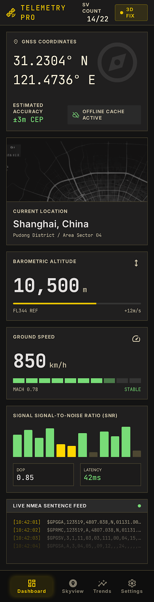
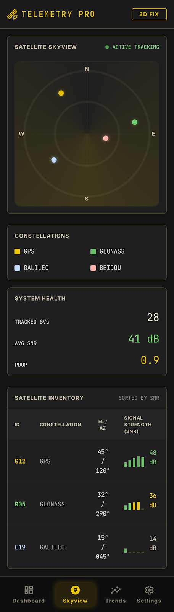
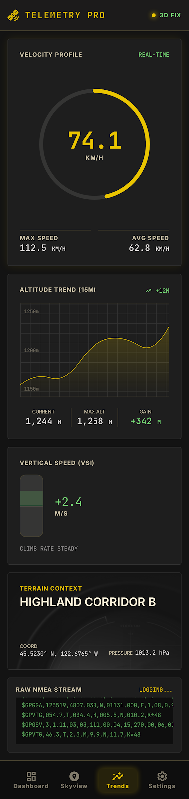
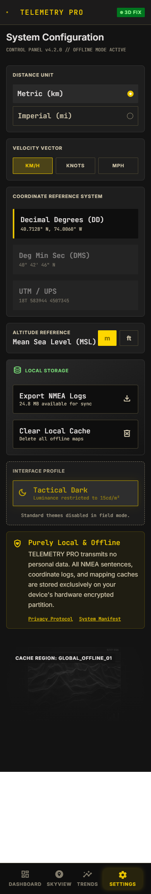

# Telemetry Pro

[](https://kotlinlang.org)
[](https://developer.android.com/compose)
[](https://developer.android.com)
[](LICENSE)

**Offline GPS telemetry monitor for aviation and outdoor environments.**

A pure-local, network-free Android app that turns your device into a glass-cockpit instrument cluster. Real-time GNSS data, multi-constellation satellite tracking, flight mode detection — all rendered in an aviation-grade dark theme.

<p align="center">
  
  
  
  
</p>

---

## Features

### Dashboard
- **GNSS coordinates** — latitude/longitude in DD and DMS formats, refreshed every second
- **Offline map** — osmdroid tile cache shows current position as a glowing dot; no city labels, no network needed
- **Constellation summary** — per-constellation satellite count, used-in-fix count, best SNR
- **Barometric altitude** and **ground speed** in km/h
- **SNR bar graph** — colour-coded by constellation, sorted by signal strength
- **NMEA log stream** — live scrolling raw sentences from the GPS receiver

### Skyview
- **Radar scanner** — animated sweep with constellation-coloured satellite dots plotted by elevation/azimuth
- **Constellation legend** — toggle individual systems on/off
- **Satellite table** — SVID, constellation, EL/AZ, SNR (dB-Hz), lock status with colour coding
- **Health summary** — total visible, used in fix, best SNR across all systems

### Trends
- **Speed gauge** — circular arc progress indicator with real-time km/h readout
- **Altitude trend** — line chart of recent elevation history
- **Vertical speed indicator (VSI)** — climb/descent rate in m/s
- **Terrain background** — subtle elevation gradient behind charts

### Settings
- **Units** — toggle between metric (km/h, m) and imperial (mph, ft)
- **Coordinate format** — DD (decimal degrees), DMS (degrees-minutes-seconds), UTM
- **Altitude reference** — WGS84 ellipsoid or MSL correction
- **Offline data** — export NMEA logs, clear cached map tiles
- **Privacy notice** — all data stays on device, zero network transmission

### Flight Mode Detection
Automatically detects high-speed/high-altitude environments:
- **Speed > 200 km/h** → "FLIGHT?" indicator
- **Altitude > 8,000 m** → "HIGH ALT" indicator

### 8-Constellation Differentiation
Each GNSS system is identified and colour-coded in every view:

| Constellation | Colour | Hex |
|:---|:---|:---|
| **GPS** (USA) | Signal Green | `#78DC77` |
| **GLONASS** (Russia) | Sky Blue | `#4FC3F7` |
| **Galileo** (EU) | Lavender Purple | `#CE93D8` |
| **BeiDou** (China) | Amber Orange | `#FFB74D` |
| **QZSS** (Japan) | Teal | `#4DB6AC` |
| **IRNSS** (India) | Rose Pink | `#F48FB1` |
| **SBAS** | Neutral Grey | `#9E9E9E` |
| **Unknown** | Dark Grey | `#616161` |

Identified via Android `GnssStatus.getConstellationType()` (API 26+). Each constellation shows aggregated stats: total visible, used-in-fix count, average SNR, and best SNR.

---

## Architecture

```
┌─────────────────────────────────────────────────────┐
│                   Jetpack Compose UI                  │
│  ┌──────────┐ ┌──────────┐ ┌──────────┐ ┌────────┐ │
│  │Dashboard │ │ Skyview  │ │  Trends  │ │Settings│ │
│  └────┬─────┘ └────┬─────┘ └────┬─────┘ └───┬────┘ │
│       └─────────────┴────────────┴───────────┘       │
│                         │                            │
│              GpsViewModel (shared)                    │
│              LocationState StateFlow                  │
├──────────────────────┼──────────────────────────────┤
│               GpsRepository                          │
│  ┌──────────────────┼──────────────────────────┐    │
│  │         LocationManager (Android)           │    │
│  │  ┌──────────┐ ┌──────────┐ ┌────────────┐  │    │
│  │  │Location  │ │GnssStatus│ │  NMEA      │  │    │
│  │  │Listener  │ │Callback  │ │  Listener  │  │    │
│  │  │(1s ticks)│ │(raw GNSS)│ │(sentences) │  │    │
│  │  └──────────┘ └──────────┘ └────────────┘  │    │
│  └────────────────────────────────────────────┘    │
├──────────────────────────────────────────────────────┤
│                  Android GNSS HAL                     │
└──────────────────────────────────────────────────────┘
```

### Key Design Decisions

**MVVM + StateFlow**
Single `GpsViewModel` shared across all screens. `LocationState` is a single data class consumed by every view; no per-screen state fragmentation. Uses `WhileSubscribed(5000)` sharing strategy so the GPS keeps running for 5s after the last observer disappears — prevents rapid stop/start on tab switches.

**No Google Play Services**
Uses only `android.location.LocationManager` APIs. This means:
- Works on AOSP / non-Google devices
- No network dependency whatsoever
- Full GNSS raw access via `GnssStatus.Callback` (API 24+)

**Constellation-Aware from the Ground Up**
The `Constellation` enum maps 1:1 to Android's `GnssStatus.CONSTELLATION_*` constants. Every satellite carries its constellation identity through the data layer into the UI — SNR bars, skyview dots, and stats tables are all colour-coded by system. `ConstellationStats` groups refine per-system metrics including average SNR and best SNR.

**1-Second Refresh Cycle**
Three parallel data streams feed the UI at 1 Hz:
1. `LocationListener` → position, speed, altitude
2. `GnssStatus.Callback` → satellite constellation data
3. `NMEAListener` → raw sentence buffer (last 30 lines)

This gives the glass-cockpit feel without burning CPU — no polling, all event-driven.

---

## Project Structure

```
TelemetryPro/
├── app/
│   ├── build.gradle.kts              # App-level dependencies
│   └── src/main/
│       ├── AndroidManifest.xml       # Permissions, activity declaration
│       ├── java/com/telemetrypro/app/
│       │   ├── MainActivity.kt       # Entry point, nav host, permission logic
│       │   ├── data/
│       │   │   ├── Constellation.kt  # GNSS system enum + colour mapping
│       │   │   ├── GpsRepository.kt  # LocationManager wrapper, all GPS logic
│       │   │   ├── LocationState.kt  # UI state data class
│       │   │   └── SatelliteInfo.kt  # Per-satellite + aggregated stats models
│       │   ├── viewmodel/
│       │   │   └── GpsViewModel.kt   # Shared ViewModel, lifecycle management
│       │   └── ui/
│       │       ├── theme/
│       │       │   ├── Color.kt      # Astra Precision full palette
│       │       │   ├── Type.kt       # JetBrains Mono + Inter typography
│       │       │   ├── Shape.kt      # 12dp rounded corners
│       │       │   └── Theme.kt      # Dark M3 theme with glow effects
│       │       ├── components/
│       │       │   ├── BottomNavBar.kt
│       │       │   ├── ConstellationStats.kt
│       │       │   ├── NmeaFeed.kt
│       │       │   ├── ReadoutTile.kt
│       │       │   ├── SnrBarGraph.kt
│       │       │   ├── StatusPip.kt
│       │       │   └── TopAppBar.kt
│       │       └── screens/
│       │           ├── DashboardScreen.kt
│       │           ├── SettingsScreen.kt
│       │           ├── SkyviewScreen.kt
│       │           └── TrendsScreen.kt
│       └── res/
│           ├── drawable/             # Vector launcher icon
│           ├── mipmap-anydpi-v26/    # Adaptive icon
│           └── values/               # strings.xml, themes.xml
├── build.gradle.kts                  # Root Gradle config
├── settings.gradle.kts               # Project settings
├── gradle.properties                 # Gradle JVM args
└── gradle/wrapper/
    └── gradle-wrapper.properties     # Gradle 8.2 wrapper
```

---

## Design System — Astra Precision

This project implements the **Astra Precision** design language — a high-contrast, aviation glass-cockpit aesthetic engineered for outdoor legibility and rapid data scanning.

### Palette

| Role | Colour | Usage |
|:---|:---|:---|
| Background | `#131313` | Deep charcoal void |
| Surface | `#201F1F` | Card tiles |
| Primary (Safety Yellow) | `#FFD700` | Fix status, critical data |
| Secondary (Signal Green) | `#78DC77` | Health, locked satellites |
| Tertiary (Atmospheric Blue) | `#2196F3` | Auxiliary data |
| Error | `#FFB4AB` | Warnings, errors |
| On-Surface | `#E5E2E1` | Primary text |

### Typography

- **JetBrains Mono** — all numeric values, coordinates, timestamps (monospaced to prevent text jitter on value change)
- **Inter** — all labels, navigation, instructional text

### Effects

- **Glow**: Primary/secondary elements emit a `12px` soft glow (box-shadow) simulating LED/CRT phosphor
- **Status pip**: Breathing animation on the "3D FIX" indicator
- **Depth**: Tonal layer stacking instead of shadows; input fields appear recessed via inner borders

---

## Build

### Prerequisites

- **JDK 17** (e.g. Eclipse Temurin)
- **Android SDK 34** with build-tools 34.0.0
- **Gradle 8.2** (wrapper included)

### Quick Build

```bash
# Clone
git clone https://github.com/th2006464/TelemetryPro.git
cd TelemetryPro

# Build debug APK
./gradlew assembleDebug
```

Output: `app/build/outputs/apk/debug/app-debug.apk`

### IDE

Open in Android Studio Hedgehog (2023.1.1) or later. Sync Gradle, then run on device/emulator.

### Environment

| Component | Version |
|:---|:---|
| Kotlin | 1.9.21 |
| Compose BOM | 2023.10.01 |
| Compose Compiler | 1.5.7 |
| Min SDK | 26 (Android 8.0) |
| Target SDK | 34 |
| Gradle | 8.2 |
| osmdroid | 6.1.18 |

---

## Development Notes & Lessons Learned

### From HTML Prototype to Compose

The original concept was prototyped as four static HTML + Tailwind CSS pages. Translating that to Compose required several deliberate decisions:

**1. Theme as Code, Not CSS Variables**
The Astra Precision design token file (YAML) was ported 1:1 into `Color.kt`, `Type.kt`, and `Shape.kt`. Compose's `MaterialTheme` is configured to use a custom dark color scheme that mirrors every slot in the original palette — `surface`, `surfaceVariant`, `onSurface`, etc. This means any new screen added later will automatically inherit the aviation aesthetic.

**2. Font Hosting Strategy**
The HTML prototype loaded JetBrains Mono and Inter from Google Fonts CDN. For the APK, fonts are bundled as Android `font` resources — ensuring they work offline from first launch. This was critical since the entire app is meant to function without network.

**3. osmdroid for Offline Maps**
Google Maps requires Play Services and a network connection. osmdroid uses OpenStreetMap tiles with a configurable disk cache, making it the only viable option for a fully offline map component. The map view is configured to render a plain vector map with `setLabelsIgnored(true)` — position dot only, no city names.

**4. GnssStatus.Callback vs GpsStatus.Listener**
Using the modern `GnssStatus.Callback` (API 24+) instead of the deprecated `GpsStatus.Listener` gives access to `getConstellationType()` — the key API that enables 8-system differentiation. The enhanced callback also provides `hasAlmanacData()` and `hasEphemerisData()` per satellite, and fires `onFirstFix()` with time-to-first-fix in milliseconds.

**5. Single ViewModel Architecture**
With four screens sharing the same GPS data source, a single `GpsViewModel` avoids duplicate listeners and ensures consistent state. The GPS lifecycle is managed via `onResume`/`onPause` in `MainActivity`, not per-screen — tab switching doesn't restart the GNSS engine.

**6. Speed Conversion Pitfall**
`Location.getSpeed()` returns m/s. Converting to km/h is `* 3.6`, but raw GPS speed readings are noisy at low velocities. The current implementation displays raw readings; a future improvement would be a low-pass filter (exponential moving average) to smooth out sub-1 km/h jitter.

**7. APK Build Environment**
Building on a machine without Android Studio required setting up JDK 17, Android SDK command-line tools, and Gradle wrapper manually. Key paths: `local.properties` must point to the SDK root, and `ANDROID_HOME` must be in the environment. The gradle.properties file sets `android.useAndroidX=true` and `org.gradle.jvmargs` for build performance.

---

## Permissions

```xml
ACCESS_FINE_LOCATION   -- GPS coordinates
ACCESS_COARSE_LOCATION -- Network-based fallback (not used, but declared)
FOREGROUND_SERVICE_LOCATION -- For future background logging
INTERNET               -- osmdroid tile download on first run (cached offline after)
```

On Android 12+, `ACCESS_FINE_LOCATION` must be requested at runtime. The app handles the permission flow in `MainActivity`.

---

## License

MIT — see [LICENSE](LICENSE) file.
